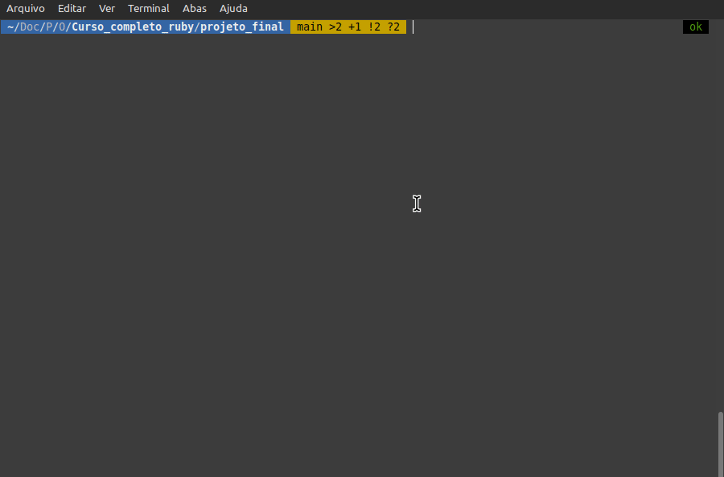
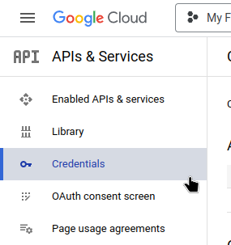
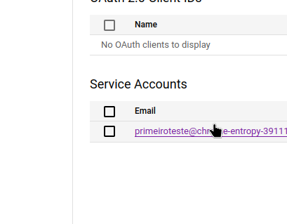
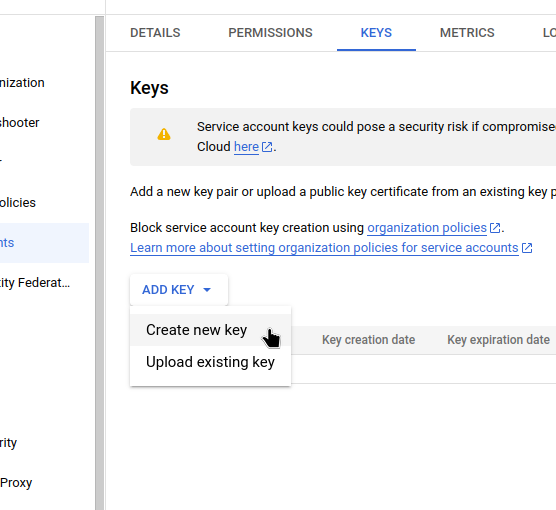
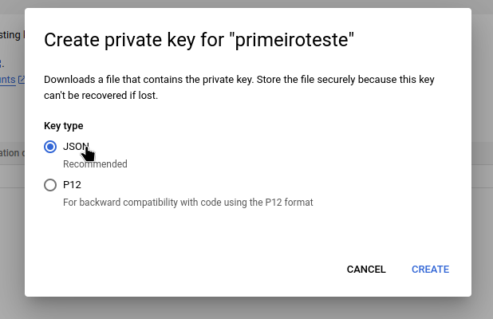
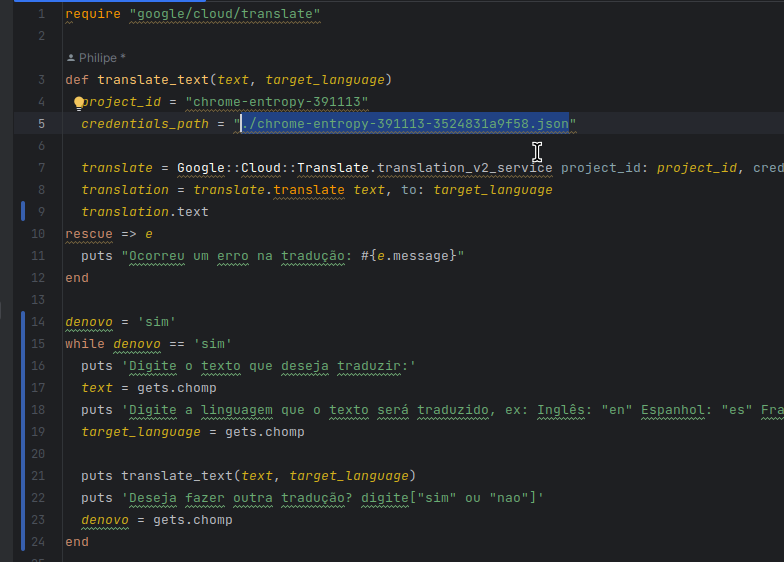
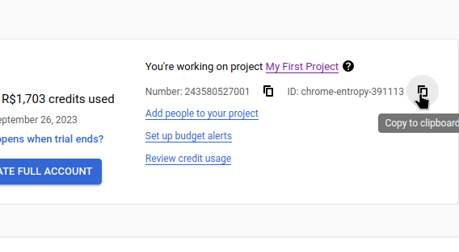
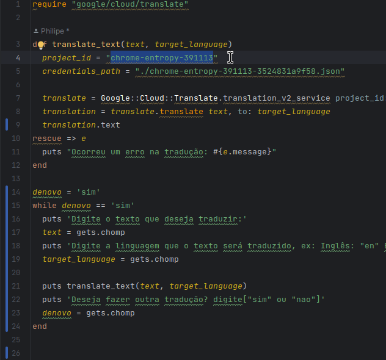

# O Projeto final é um arquivo de Tradução usando a API do Google
Este é o projeto final do curso de Ruby completo da One Bit Code, onde eu criei um arquivo Ruby que utiliza a API do Google Cloud Translation para traduzir textos para diferentes idiomas.
## Como o arquivo funciona?
- 
### Pré-requisitos
Antes de começar, você precisa ter os seguintes requisitos instalados e configurados em seu ambiente de desenvolvimento:

- Ruby 2.6 ou superior
- Gem google-cloud-translate instalada 
### Configuração da API do Google Cloud Translation
Para utilizar a API do Google Cloud Translation, siga os passos abaixo:

- Acesse o Google Cloud Console e crie um novo projeto ou selecione um projeto existente.
- Ative a API de Tradução (Cloud Translation API) para o seu projeto.
- Crie uma chave de API (API Key) para autenticação. Você precisará criar e fornecer o caminho para o arquivo JSON de credenciais da conta de serviço do Google Cloud em vez de apenas a chave da API.
### Instalação
- Clone o repositório do projeto para o seu ambiente local
- Acesse o diretório do projeto
- Instale as dependências do projeto (bundle install)

### Utilização
- Siga esse passo a passo para criar a chave API (https://alexsacchi.com.br/como-gerar-uma-api-do-google-translate/)
- Crie a credencial dentro do seu projeto no site do google
- 
- Crie a service account
- 
- Dentro de service account crie a chave
- 
- Crie e Baixe o arquivo JSON com as credenciais e salve na pasta do projeto
- 
- Substitua o caminho dentro do arquivo tradutor_de_texto.rb no projeto para o da credencial que vc baixou
- 
- Agora pra finalizar copie a ID do seu projeto no site do google
- 
- Basta colar no caminho de ID do seu projeto
- 
- Salve o arquivo após realizar as alterações.
- Execute o arquivo traducao.rb conforme o gif do início

## Contribuição
Contribuições são bem-vindas! Se você tiver alguma melhoria ou correção para propor, fique à vontade para abrir uma issue ou enviar um pull request.
